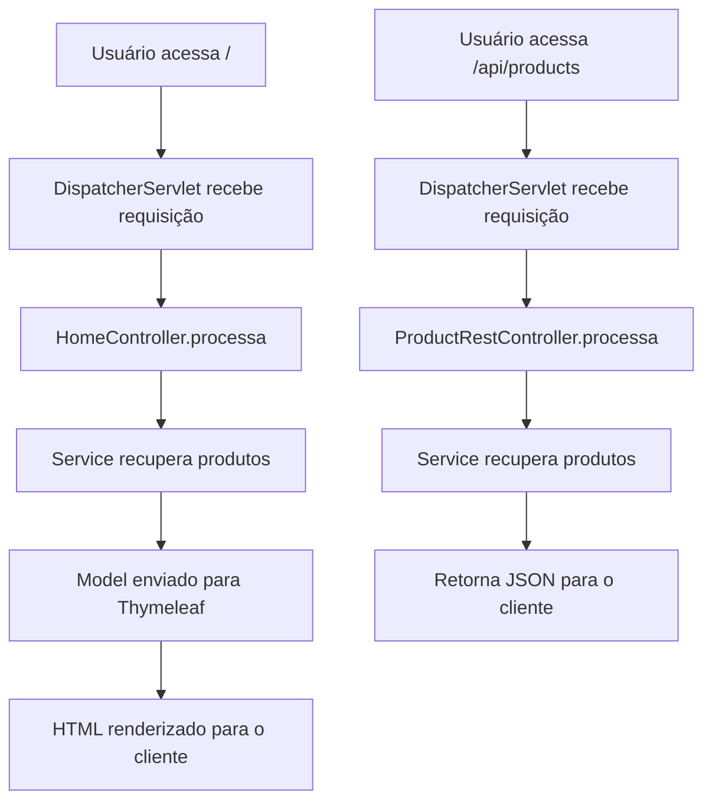

```mermaid

flowchart TD
    A[Usuário acessa /] --> B[DispatcherServlet recebe requisição]
    B --> C[HomeController.processa]
    C --> D[Service recupera produtos]
    D --> E[Model enviado para Thymeleaf]
    E --> F[HTML renderizado para o cliente]

    A2[Usuário acessa /api/products] --> B2[DispatcherServlet recebe requisição]
    B2 --> C2[ProductRestController.processa]
    C2 --> D2[Service recupera produtos]
    D2 --> E2[Retorna JSON para o cliente]

```
